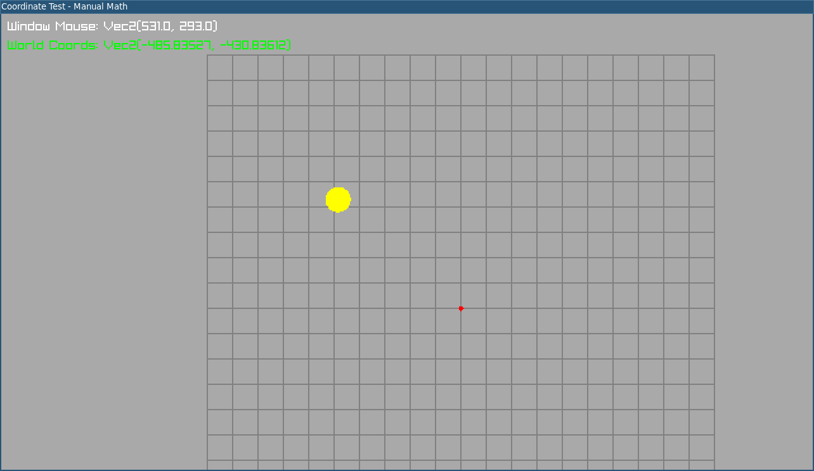

# 2d-cam-coordinate-test

Small Rust + raylib testbed for 2D camera coordinate math.

## What this was trying to do

The goal was to validate **window/screen-to-world coordinate conversion** for a 2D camera setup, especially when rendering to a low-resolution render target and scaling that up to the window.

Current prototype behavior:
- Pans camera target with `W/A/S/D`
- Zooms with mouse wheel
- Draws a world grid and origin marker
- Converts mouse window coordinates to world coordinates with manual math (`window_to_world`)
- Draws a marker at computed mouse world position to visually confirm correctness

## When this is from

There is no git commit history in the original local folder (`coordtest`), so exact commit dates do not exist.

Based on local filesystem timestamps:
- Project/repo files were first created around **June 22, 2025**
- `src/main.rs` timestamp is around **June 22, 2025**

This repository is an archive/import of that local prototype.
